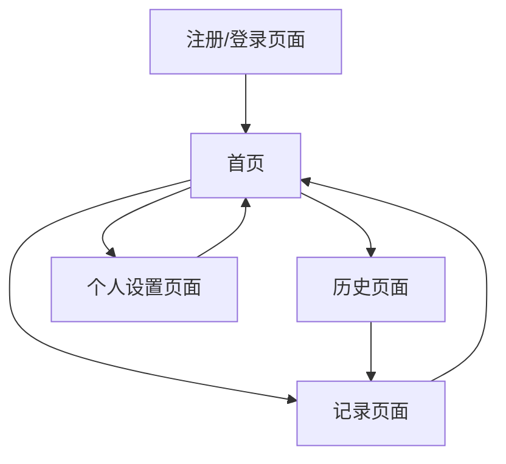

# AI日常记录分析应用 - 产品需求文档

## 1. 产品概述

一个专注于日常片段信息记录并利用AI进行智能总结分析的web应用。用户可以通过录音、截图、拍照等方式记录生活片段，AI会根据用户的个人画像自动生成个性化的分析和总结，帮助用户更好地了解自己的生活模式和情感状态。

产品旨在为用户提供一个温暖、治愈的数字空间，通过AI技术让日常记录变得更有意义和洞察力。

## 2. 核心功能

### 2.1 用户角色

| 角色 | 注册方式 | 核心权限 |
|------|----------|----------|
| 普通用户 | 邮箱注册 | 可记录内容、查看AI分析、管理个人数据 |

### 2.2 功能模块

我们的AI日常记录应用包含以下主要页面：
1. **注册/登录页面**：用户身份验证，个人画像设置
2. **首页**：快速记录入口，最近记录展示，预生成示例数据
3. **记录页面**：录音、拍照、截图上传，AI分析展示
4. **历史页面**：日历视图，记录列表，AI分析查看
5. **个人设置页面**：用户画像编辑，偏好设置

### 2.3 页面详情

| 页面名称 | 模块名称 | 功能描述 |
|----------|----------|----------|
| 注册/登录页面 | 用户认证 | 邮箱注册登录，密码重置 |
| 注册/登录页面 | 个人画像设置 | 编辑MBTI、职业、性格、主要工作等基础信息 |
| 首页 | 快速记录入口 | 一键录音、拍照、截图上传按钮 |
| 首页 | 最近记录展示 | 显示最近3-5条记录和AI分析摘要 |
| 首页 | 预生成数据 | 展示示例记录帮助用户理解应用用法 |
| 记录页面 | 多媒体录制 | 录音功能，实时语音转文本预览 |
| 记录页面 | 图片上传 | 拍照、截图上传，图片预览 |
| 记录页面 | AI分析引擎 | 根据用户画像生成个性化分析和总结 |
| 记录页面 | 记录保存 | 保存原始内容和AI分析结果 |
| 历史页面 | 日历视图 | 按日期查看历史记录，支持月份切换 |
| 历史页面 | 记录列表 | 时间线形式展示所有记录 |
| 历史页面 | 筛选搜索 | 按类型、关键词筛选记录 |
| 个人设置页面 | 画像管理 | 编辑和更新个人基础信息 |
| 个人设置页面 | 偏好设置 | AI分析风格、通知设置等 |

## 3. 核心流程

**用户注册流程：**
用户访问应用 → 邮箱注册 → 设置个人画像（MBTI、职业、性格等） → 查看预生成示例数据 → 开始使用

**记录创建流程：**
首页快速入口 → 选择记录类型（录音/拍照/截图） → 上传内容 → AI自动分析 → 查看分析结果 → 保存记录

**历史查看流程：**
历史页面 → 选择日历日期或浏览列表 → 查看具体记录 → 查看AI分析详情

## 4. 用户界面设计

### 4.1 设计风格

- **主色调**：奶白色 (#FEFEFE)、雾紫色 (#E6E0F8)、淡蓝色 (#E8F4FD)
- **辅助色**：柔和粉色 (#F5F0FF)、浅灰色 (#F8F9FA)
- **按钮风格**：圆角矩形，果冻质感，轻微阴影和渐变效果
- **字体**：优雅的无衬线字体，主要字号16px，标题20-24px
- **布局风格**：卡片式设计，大量留白，柔和的分割线
- **图标风格**：线性图标，圆润风格，与整体设计保持一致
- **动效**：缓动函数使用ease-out，过渡时间300-500ms，微妙的弹性效果

### 4.2 页面设计概览

| 页面名称 | 模块名称 | UI元素 |
|----------|----------|--------|
| 注册/登录页面 | 用户认证 | 柔和渐变背景，圆角输入框，果冻质感按钮，微妙阴影效果 |
| 注册/登录页面 | 个人画像设置 | 分步骤表单，进度指示器，下拉选择器使用奶白和雾紫配色 |
| 首页 | 快速记录入口 | 大型圆形按钮，悬浮效果，淡蓝色渐变背景 |
| 首页 | 最近记录展示 | 卡片式布局，柔和阴影，奶白背景，雾紫色标题 |
| 记录页面 | 多媒体录制 | 波形动画，实时反馈，圆形录制按钮带呼吸灯效果 |
| 记录页面 | AI分析展示 | 打字机效果显示分析结果，柔和的加载动画 |
| 历史页面 | 日历视图 | 简洁日历设计，选中日期高亮，淡蓝色标记有记录的日期 |
| 历史页面 | 记录列表 | 时间线设计，左侧时间轴，右侧内容卡片 |

### 4.3 响应式设计

应用采用移动优先的响应式设计，主要针对手机端优化，同时兼容平板和桌面端。支持触摸交互优化，包括手势操作和触觉反馈。