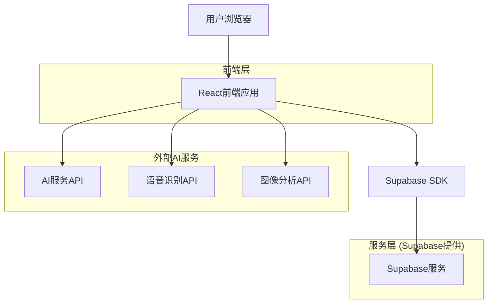
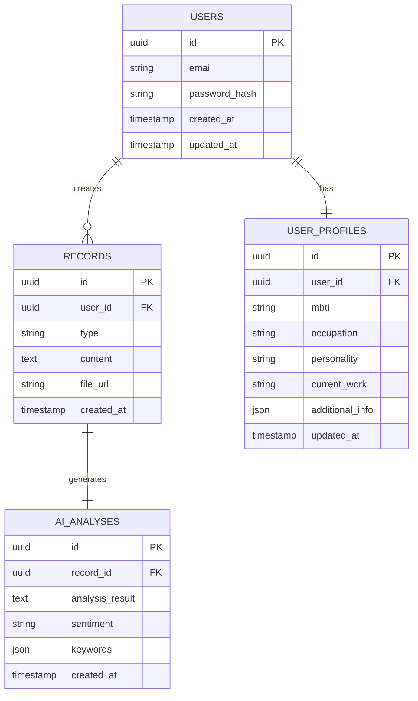

# AI日常记录分析应用 - 技术架构文档

## 1. 架构设计



## 2. 技术描述

* **前端**: React\@18 + TypeScript + Tailwind CSS + Vite + Framer Motion

* **后端**: Supabase (认证、数据库、存储)

* **AI服务**: OpenAI API (文本分析、图像分析)

* **语音识别**: Web Speech API / OpenAI Whisper API

* **状态管理**: Zustand

* **UI组件**: Headless UI + 自定义组件

## 3. 路由定义

| 路由       | 用途                     |
| -------- | ---------------------- |
| /        | 首页，显示快速记录入口和最近记录       |
| /auth    | 登录注册页面，包含用户认证和个人画像设置   |
| /record  | 记录页面，支持录音、拍照、截图上传和AI分析 |
| /history | 历史页面，日历视图和记录列表浏览       |
| /profile | 个人设置页面，用户画像编辑和偏好设置     |

## 4. API定义

### 4.1 核心API

**用户认证相关**

```
POST /auth/signup
```

请求:

| 参数名      | 参数类型   | 是否必需 | 描述     |
| -------- | ------ | ---- | ------ |
| email    | string | true | 用户邮箱   |
| password | string | true | 用户密码   |
| profile  | object | true | 用户画像信息 |

响应:

| 参数名     | 参数类型   | 描述   |
| ------- | ------ | ---- |
| user    | object | 用户信息 |
| session | object | 会话信息 |

**记录管理相关**

```
POST /api/records
```

请求:

| 参数名      | 参数类型        | 是否必需 | 描述                      |
| -------- | ----------- | ---- | ----------------------- |
| type     | string      | true | 记录类型 (audio/image/text) |
| content  | string/file | true | 记录内容                    |
| user\_id | string      | true | 用户ID                    |

响应:

| 参数名          | 参数类型   | 描述     |
| ------------ | ------ | ------ |
| record\_id   | string | 记录ID   |
| ai\_analysis | string | AI分析结果 |
| created\_at  | string | 创建时间   |

示例:

```json
{
  "type": "audio",
  "content": "今天工作很累，但是完成了一个重要项目",
  "user_id": "uuid-string"
}
```

**AI分析相关**

```
POST /api/ai/analyze
```

请求:

| 参数名           | 参数类型   | 是否必需 | 描述    |
| ------------- | ------ | ---- | ----- |
| content       | string | true | 待分析内容 |
| user\_profile | object | true | 用户画像  |
| content\_type | string | true | 内容类型  |

响应:

| 参数名       | 参数类型   | 描述     |
| --------- | ------ | ------ |
| analysis  | string | AI分析结果 |
| sentiment | string | 情感分析   |
| keywords  | array  | 关键词提取  |

## 5. 数据模型

### 5.1 数据模型定义



### 5.2 数据定义语言

**用户表 (users)**

```sql
-- 创建用户表
CREATE TABLE users (
    id UUID PRIMARY KEY DEFAULT gen_random_uuid(),
    email VARCHAR(255) UNIQUE NOT NULL,
    password_hash VARCHAR(255) NOT NULL,
    created_at TIMESTAMP WITH TIME ZONE DEFAULT NOW(),
    updated_at TIMESTAMP WITH TIME ZONE DEFAULT NOW()
);

-- 创建用户画像表
CREATE TABLE user_profiles (
    id UUID PRIMARY KEY DEFAULT gen_random_uuid(),
    user_id UUID REFERENCES users(id) ON DELETE CASCADE,
    mbti VARCHAR(10),
    occupation VARCHAR(100),
    personality TEXT,
    current_work TEXT,
    additional_info JSONB,
    updated_at TIMESTAMP WITH TIME ZONE DEFAULT NOW()
);

-- 创建记录表
CREATE TABLE records (
    id UUID PRIMARY KEY DEFAULT gen_random_uuid(),
    user_id UUID REFERENCES users(id) ON DELETE CASCADE,
    type VARCHAR(20) NOT NULL CHECK (type IN ('audio', 'image', 'text')),
    content TEXT,
    file_url VARCHAR(500),
    created_at TIMESTAMP WITH TIME ZONE DEFAULT NOW()
);

-- 创建AI分析表
CREATE TABLE ai_analyses (
    id UUID PRIMARY KEY DEFAULT gen_random_uuid(),
    record_id UUID REFERENCES records(id) ON DELETE CASCADE,
    analysis_result TEXT NOT NULL,
    sentiment VARCHAR(20),
    keywords JSONB,
    created_at TIMESTAMP WITH TIME ZONE DEFAULT NOW()
);

-- 创建索引
CREATE INDEX idx_records_user_id ON records(user_id);
CREATE INDEX idx_records_created_at ON records(created_at DESC);
CREATE INDEX idx_ai_analyses_record_id ON ai_analyses(record_id);
CREATE INDEX idx_user_profiles_user_id ON user_profiles(user_id);

-- 设置权限
GRANT SELECT ON records TO anon;
GRANT ALL PRIVILEGES ON records TO authenticated;
GRANT SELECT ON ai_analyses TO anon;
GRANT ALL PRIVILEGES ON ai_analyses TO authenticated;
GRANT SELECT ON user_profiles TO anon;
GRANT ALL PRIVILEGES ON user_profiles TO authenticated;

-- 初始化示例数据
INSERT INTO users (email, password_hash) VALUES 
('demo@example.com', 'hashed_password_demo');

INSERT INTO user_profiles (user_id, mbti, occupation, personality, current_work) VALUES 
((SELECT id FROM users WHERE email = 'demo@example.com'), 'INFP', '产品经理', '内向、直觉、情感、感知', '负责一个移动应用的产品设计和用户体验优化');

INSERT INTO records (user_id, type, content) VALUES 
((SELECT id FROM users WHERE email = 'demo@example.com'), 'text', '今天的产品评审会议很顺利，团队对新功能的反馈都很积极'),
((SELECT id FROM users WHERE email = 'demo@example.com'), 'text', '下午和设计师讨论了用户界面的改进方案，感觉找到了很好的解决思路'),
((SELECT id FROM users WHERE email = 'demo@example.com'), 'text', '晚上读了一本关于用户心理学的书，对理解用户需求有了新的启发');
```

